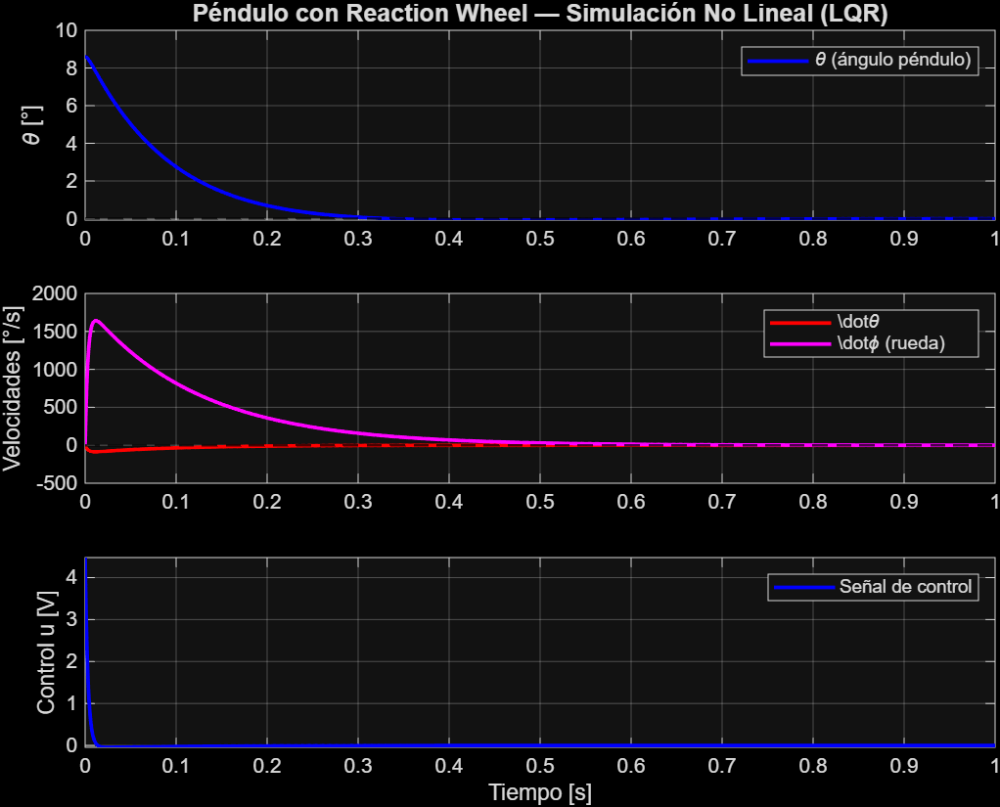
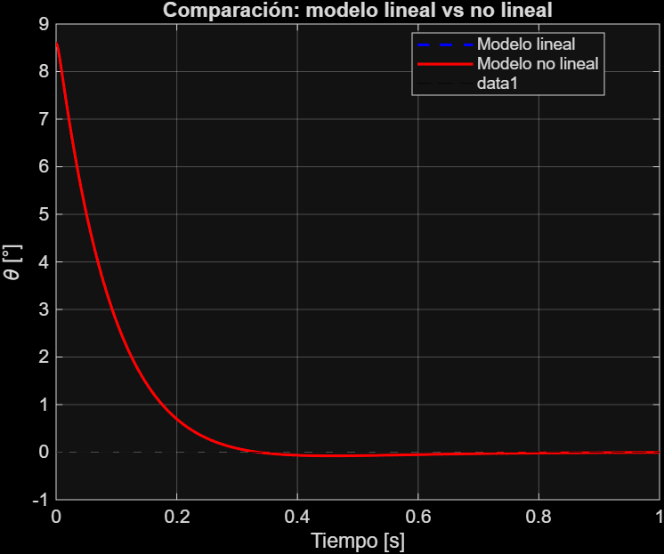

# Reaction Wheel Inverted Pendulum 

> Plataforma educativa open-source de control moderno basada en un péndulo invertido con rueda de inercia. Implementa control LQR (Regulador Cuadrático Lineal) con modelado por mecánica Lagrangiana, simulación en MATLAB y hardware basado en ESP32.

<p align="center">
  
</p>

<p align="center">
  
  
  
  
  
</p>

---

##  Contenido

- [Descripción del proyecto](#-descripción-del-proyecto)
- [Motivación y problemática](#-motivación-y-problemática)
- [Teoría y fundamentos](#-teoría-y-fundamentos)
- [Estructura del repositorio](#-estructura-del-repositorio)
- [Hardware requerido](#-hardware-requerido)
- [Diagrama electrónico](#-diagrama-electrónico)
- [Instalación y uso](#-instalación-y-uso)
- [Simulación en MATLAB](#-simulación-en-matlab)
- [Resultados](#-resultados)
- [Trabajo futuro](#-trabajo-futuro)
- [Referencias](#-referencias)
- [Licencia](#-licencia)

---

##  Descripción del proyecto

El **Reaction Wheel Inverted Pendulum (RWIP)** es un sistema mecatrónico que mantiene un péndulo en posición vertical utilizando el momento angular generado por una rueda giratoria montada en su extremo superior. A diferencia del péndulo de carro clásico, no requiere traslación lineal — el único actuador es el motor que acelera y desacelera la rueda de inercia.

Este proyecto implementa:

- **Modelado matemático completo** mediante mecánica Lagrangiana
- **Linealización** del sistema no lineal alrededor del punto de equilibrio inestable
- **Representación en espacio de estados** con verificación de controlabilidad
- **Diseño del controlador LQR** mediante la ecuación algebraica de Riccati
- **Simulación no lineal** en MATLAB/Simulink con comparación lineal vs no lineal
- **Sensado** con encoder incremental óptico (ángulo péndulo) y encoder magnético AS5600 (velocidad rueda)
- **Estructura mecánica** completamente imprimible en 3D

---

##  Motivación y problemática

Los estudiantes de ingeniería en control moderno aprenden conceptos como espacio de estados y LQR sin acceso a plantas físicas para experimentar. Las plataformas comerciales equivalentes como el **Quanser QUBE-Servo 2** tienen un costo de entre **\$3,000 y \$8,000 USD**, lo que las hace inaccesibles para la mayoría de instituciones educativas en México y Latinoamérica.

Este proyecto propone una plataforma educativa **open-source y replicable** con un costo de aproximadamente **\$30–45 USD**, que permite:

- Derivar y verificar experimentalmente el modelo matemático de un sistema no lineal real
- Implementar y comparar estrategias de control (PID vs LQR)
- Visualizar en tiempo real el efecto de cada ganancia del controlador
- Replicarse en cualquier institución con impresora 3D

El principio físico de las reaction wheels es el mismo utilizado en **satélites y telescopios espaciales** para control de actitud sin propulsión química, lo que le da al proyecto un contexto de aplicación de alto impacto.

---

##  Teoría y fundamentos

### Sistema físico

El sistema tiene **2 grados de libertad**:
- `θ` — ángulo del péndulo respecto a la vertical
- `φ` — ángulo de la rueda respecto al péndulo

### Ecuaciones de movimiento (Lagrangiano)

La energía cinética total del sistema es:

$$T = \frac{1}{2}(I_p + m_w L^2)\dot{\theta}^2 + \frac{1}{2}I_w(\dot{\theta} + \dot{\phi})^2$$

Donde el primer término incluye la contribución traslacional de la rueda mediante el teorema de Steiner. Aplicando las ecuaciones de Euler-Lagrange se obtiene:

$$\ddot{\theta} = \frac{(m_p l + m_w L)g\sin\theta - \tau}{I_{total}}$$

$$\ddot{\phi} = \frac{\tau}{I_w} - \ddot{\theta}$$

### Linealización y espacio de estados

Linealizando alrededor de `θ = 0` con `sin θ ≈ θ`, el sistema toma la forma:

$$\dot{\mathbf{x}} = A\mathbf{x} + Bu, \quad \mathbf{x} = \begin{bmatrix}\theta \\ \dot{\theta} \\ \dot{\phi}\end{bmatrix}$$

$$A = \begin{bmatrix} 0 & 1 & 0 \\ \frac{M_g}{I_{total}} & 0 & 0 \\ -\frac{M_g}{I_{total}} & 0 & -\frac{b_{eq}}{I_w} \end{bmatrix}, \quad B = \begin{bmatrix} 0 \\ -\frac{1}{I_{total}} \\ \frac{1}{I_w} + \frac{1}{I_{total}} \end{bmatrix}$$

### Control LQR

El controlador LQR minimiza la función de costo:

$$J = \int_0^\infty (\mathbf{x}^T Q \mathbf{x} + u^T R u)\, dt$$

Las ganancias óptimas `K` se obtienen resolviendo la Ecuación Algebraica de Riccati:

$$A^T P + PA - PBR^{-1}B^T P + Q = 0 \quad \Rightarrow \quad K = R^{-1}B^T P$$

La ley de control es `u = -Kx`, con `u` siendo el voltaje aplicado al motor.

Para la derivación completa con todos los pasos intermedios, ver [`docs/teoria_completa.pdf`](docs/teoria_completa.pdf).

---

##  Estructura del repositorio

```
Reaction_wheel_pendulum/
│
│
├── CAD/                             # Diseño mecánico
│   ├── STL/                         # Archivos listos para imprimir
│   │   ├── Arm_V10_STL.stl
│   │   ├── Support_V5.stl
│   │   ├── Tower_V7_STL.stl
│   │   └── Wheel_V5_STL.stl
│   ├──planos/                      # Planos dimensionales PDF
│   │   ├── Arm.pdf
│   │   ├── ExplodedView.pdf
│   │   ├── Support_V5.pdf
│   │   ├── Tower_V7.pdf
│   │   └── Wheel_V5_Sheet.pdf
│   └──step/                        # Archivos STEP 
│       └── ensamble_completo.step
│
├── System_dinamics_test/            # Simulación y diseño de control
│   ├── params.m                     # Parámetros físicos del sistema
│   ├── model.m                      # Matrices A,B, controlabilidad, LQR
│   ├── simulation.m                 # Simulación no lineal ODE45
│   ├── system.m                     # Función dinámica no lineal 
│   └── resultados/                  # Gráficas exportadas
│       ├── respuesta_lineal.png
│       ├── simulacion_no_lineal.png
│       ├── lineal_vs_nolineal.png
│       └── lugar_de_raices.png
│
├── docs/                            # Documentación adicional
│   ├── teoria_completa.pdf          # Derivación matemática completa
│   └── img/
│       └── Assembly 1.png
│
├── src/                        # Código ESP32
│   ├── main/
│   │   ├── rwp_main.ino             # Controlador LQR completo
│   │   └── real_time_monitor.py     # Monitor en tiempo real
│   └── tools/
│       ├── sensors.h                # Lectura AS5600 + Encoder
│       └── identify_deadzone.ino    # Identificación zona muerta motor
│
├── electronics/                     # Diseño electrónico
│   └── schematic.pdf                # Esquemático completo
│
├── README.md
└── LICENSE

```

---

##  Hardware requerido

### Lista de componentes

| Componente | Modelo | Cantidad | Función | Costo aprox. |
|---|---|---|---|---|
| Microcontrolador | ESP32 DevKit v1 | 1 | Control en tiempo real | \$5–8 USD |
| Encoder ángulo péndulo | 3806-OPTI-600-AB-OC | 1 | Medir θ | (disponible) |
| Encoder velocidad rueda | AS5600 + imán diametral | 1 | Medir φ̇ | \$3–4 USD |
| Motor reaction wheel | Motor DC 775 sin reductora | 1 | Actuador | \$5–8 USD |
| Driver de motor | L298N o TB6612FNG | 1 | Amplificar señal PWM | \$2–4 USD |
| Fuente de poder | LiPo 18V o fuente regulada | 1 | Alimentación motor | \$8–12 USD |
| Rodamientos | 608-2RS (8mm) | 2 | Pivote del péndulo | \$1–2 USD |
| Tornillería | M3 × 10mm, M3 × 20mm | surtido | Ensamble | \$1 USD |
| Filamento 3D | PLA o PETG | ~250g | Estructura | \$3–5 USD |

**Costo total estimado: \$28–44 USD**

### Parámetros físicos del sistema (CAD)

| Parámetro | Símbolo | Valor | Fuente |
|---|---|---|---|
| Masa brazo + motor | `m_p` | 0.42 kg | Onshape |
| Distancia pivote-CM péndulo | `l` | 0.18 m | Onshape |
| Distancia pivote-rueda | `L` | 0.20 m | Onshape |
| Inercia total respecto al pivote | `I_total` | 0.0212 kg·m² | Onshape |
| Masa de la rueda | `m_w` | 0.09 kg | Onshape |
| Radio de la rueda | `r_w` | 0.06 m | CAD |
| Inercia de la rueda | `I_w` | 3.24×10⁻⁴ kg·m² | Calculado |

### Parámetros del motor 775

| Parámetro | Símbolo | Valor | Fuente |
|---|---|---|---|
| Resistencia de armadura | `Ra` | 0.80 Ω | Datasheet / medición |
| Constante de torque | `Kt` | 0.038 N·m/A | Datasheet / medición |
| Constante FCEM | `Ke` | 0.038 V·s/rad | Datasheet / medición |
| Voltaje nominal | `Vmax` | 18 V | — |
| Torque máximo | `τ_max` | 0.855 N·m | Calculado |

---

Notas:
  • Encoder 3806: pull-up 3.3kΩ en canal A y B hacia 3.3V (open collector)
  • AS5600: imán diametral centrado a 0.5–3mm del sensor
  • Capacitor 100µF entre VCC y GND del driver (desacoplo)
  • Masa común entre ESP32, driver y fuente

El esquemático completo en EasyEDA se encuentra en [`electronics/schematic.pdf`](electronics/schematic.pdf).

---

##  Instalación y uso

### Requisitos

- Arduino IDE 2.x con soporte ESP32 (board manager: `https://dl.espressif.com/dl/package_esp32_index.json`)
- Librería `Wire.h` (incluida en ESP32 core)
- MATLAB R2022a o superior (para simulación)
- Python 3.8+ con `pyserial` y `matplotlib` (para telemetría en tiempo real)

### 1. Clonar el repositorio

```bash
git clone https://github.com/tu-usuario/reaction-wheel-pendulum.git
cd reaction-wheel-pendulum
``` 

### 2. Configurar parámetros

Edita `firmware/main/config.h` con tus ganancias de MATLAB:

```cpp
// Ganancias LQR — copiar exactamente de MATLAB
const float K_theta    = 15.0;
const float K_thetadot = 8.0;
const float K_phidot   = 2.0;

// Parámetros del sistema
const float VMAX          = 18.0;
const float THETA_MAX_DEG = 25.0;
const int   PWM_DEADZONE  = 18;
```

### 3. Cargar firmware al ESP32

```bash
# Desde Arduino IDE: seleccionar placa "ESP32 Dev Module"
# Puerto: el que corresponda a tu ESP32
# Cargar rwp_main.ino
```

### 4. Flujo de operación

```
1. Encender → verificar salida serial (115200 baud)
2. Confirmar "✓ Imán OK" del AS5600
3. Posicionar péndulo en vertical
4. Enviar cualquier carácter por serial → establece cero
5. Enviar 'S' → activa el controlador
6. Enviar 'P' → pausa
7. Enviar 'R' → restablece cero si el péndulo cayó
```

### 5. Visualización en tiempo real (opcional)

```bash
pip install pyserial matplotlib
python docs/graficar_serial.py
# Editar PORT en el script según tu sistema
```

---

##  Simulación en MATLAB

### Correr la simulación completa

```matlab
% En MATLAB, desde la carpeta /matlab:
run('Parametros.m')   % 1. Cargar parámetros físicos
run('Modelo.m')       % 2. Diseñar LQR y verificar estabilidad
run('Simulacion.m')   % 3. Simular sistema no lineal
```

### Parámetros de diseño LQR

```matlab
% Matrices de peso — ajustables
Q = diag([10, 8, 5]);   % [q_theta, q_thetadot, q_phidot]
R = 300;                % penalización del esfuerzo de control
```

### Resultados de simulación

| Métrica | Valor |
|---|---|
| Condición inicial | 8.59° |
| Tiempo de establecimiento | 0.140 s |
| Sobreimpulso | 0.0 % |
| Control máximo | 4.59 V |
| Margen de voltaje | 74.5% |
| Polos en lazo cerrado | parte real negativa ✓ |

---

##  Resultados

### Respuesta del controlador LQR

<p align="center">
  
</p>

### Comparación modelo lineal vs no lineal

<p align="center">
  
</p>

La diferencia entre ambos modelos corresponde al error de linealización (`sinθ ≈ θ`), que produce un undershoot de ~0.8° en el modelo no lineal. Este comportamiento es esperado y se documenta como parte del análisis de validez del modelo linealizado.

---

##  Trabajo futuro

- [ ] **Identificación experimental** de parámetros del motor (Kt, Ra, Ke)
- [ ] **Comparación PID vs LQR** con métricas cuantitativas (ISE, IAE, ITAE)
- [ ] **Control swing-up** mediante control por energía para llevar el péndulo desde posición colgante hasta vertical
- [ ] **Filtro de Kalman** para estimación de estados con fusión de sensores
- [ ] **Extensión a 2 ejes** (dual axis reaction wheel — balanceo sobre una punta)
- [ ] **Interfaz web** vía WiFi del ESP32 para ajuste de ganancias en tiempo real
- [ ] **Validación experimental** con comparación cuantitativa simulación vs hardware

---

##  Referencias

1. Krafes, S. et al. *"Design, Implementation, and Control of a Wheel-Based Inverted Pendulum"*, MDPI Electronics, 2024. [DOI: 10.3390/electronics13030514](https://doi.org/10.3390/electronics13030514)

2. Nguyen, B.H. et al. *"Modelling and control of a reaction wheel pendulum using a linear quadratic regulator"*, ResearchGate, 2021. [Link](https://www.researchgate.net/publication/351314795)

3. Gajamohan, M. et al. *"Nonlinear Analysis and Control of a Reaction Wheel-based 3D Inverted Pendulum (Cubli)"*, ETH Zürich, 2013. [PDF](https://ethz.ch/content/dam/ethz/special-interest/mavt/dynamic-systems-n-control/idsc-dam/Research_DAndrea/Cubli/RevisedManuscript.pdf)

4. Borase, R.P. et al. *"Reaction Wheel Pendulum Stabilization Using Various State-Space Representations"*, MDPI Electronics, 2025. [DOI: 10.3390/electronics14234719](https://doi.org/10.3390/electronics14234719)

5. SimpleFOC Project. *"Arduino BLDC Reaction Wheel Inverted Pendulum"*. [GitHub](https://github.com/simplefoc/Arduino-FOC-reaction-wheel-inverted-pendulum)

6. Rouleau, M. *"Self-Balancing Stick — Dual Axis Reaction Wheel Inverted Pendulum"*. [GrabCAD](https://grabcad.com/library/self-balancing-stick-dual-axis-reaction-wheel-inverted-pendulum-1)

---

##  Autor

Desarrollado como **proyecto integrador de 5° cuatrimestre** de la carrera de Ingeniería Mecatrónica **Institución:** Universidad Tecnológica de Corregidora
**Materia:** Sistemas de Control / Proyecto Integrador  
**Periodo:** 2026

---

##  Licencia

Este proyecto está bajo la licencia MIT. Consulta el archivo [LICENSE](LICENSE) para más detalles.

Puedes usar, modificar y distribuir este proyecto libremente, incluyendo para fines educativos e institucionales. Si lo usas en un trabajo académico, se agradece la cita correspondiente.

---

<p align="center">
  Hecho con café y demasiadas horas en MATLAB
</p>
